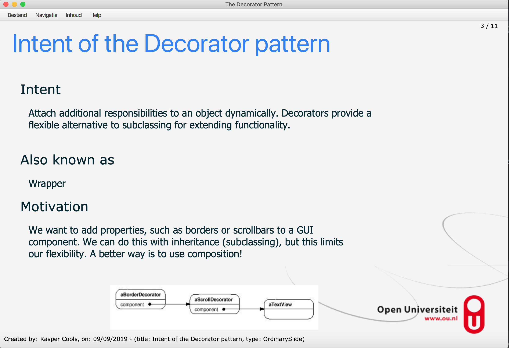

## Table of Contents

- [Table of Contents](#table-of-contents)
- [About The Project](#about-the-project)
- [Getting Started](#getting-started)
  - [Device configuration and startup](#device-configuration-and-startup)
- [Quick walkthrough](#quick-walkthrough)


## About The Project

This application is an updated version of Ian Darwin's [JabberPoint](https://github.com/IanDarwin/jabberpoint).
This is a revisioned version the JabberPoint application’s architecture in the context of one of the Software Engineering courses at the [Open University](https://www.ou.nl/-/macs-2020-2021_master-computer-science-msc-)

## Getting Started

To get a local copy up and running follow these simple steps.

### Device configuration and startup

1. Install [Java JDK 12] (https://jdk.java.net/12)
2. Install [JavaFX 12 SDK] (https://openjfx.io/openjfx-docs)
3. Running the application can be done by:
    1. running the ```./gradlew run``` command via the commandline interface
    2. running the application using an IDE like Eclipse or Intellij
        * when using the run/debug options via the IDE itself you will have to include the javafx sdk by adding following VM options:
```--module-path="/path/to/javafx-sdk-12.0.2/lib" --add-modules=javafx.controls,javafx.fxml``` which can be configured via the __Run/Debug Configuration__ window

## Quick walkthrough
This specific Jabberpoint implementation is written in JavaFX. Jabberpoint reads out XML definitions in order for it to know what each slide look like. In this particular version it is possible to define different subsets within a presentation file. This enables you to select specific slides to be shown or skipped while presenting.




